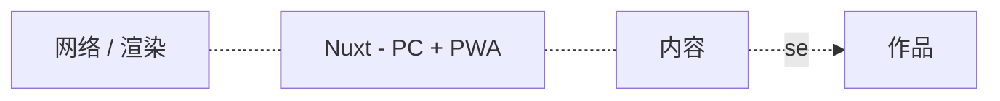

### 👋Hi ， welcome to my 2b's zone
<h1 align="center">
</a>
</h1>

<div align="center">
</div>
<br>
<div align="center">
  <a href="https://p8d.gitee.io/zone"></a>&emsp;
<!--   <a href="https://twitter.com/anzhiyu_c"></a>&emsp;
  <a href="https://www.youtube.com/channel/UC1zFQPt_DccDr0pn60jzoQQ"></a>&emsp;
  <a href="https://blog.csdn.net/CZW2268025923?spm=1010.2135.3001.5343"></a>&emsp;
  <a href="https://space.bilibili.com/372204786"></a>&emsp;
  <a href="https://www.zhihu.com/people/xi-gua-pi-pi-60"></a>&emsp; -->
</div>

    
## 已上线/即将上线/长期深耕维护的项目
#### 欢迎关注公众号 - 可以服饰
#### 可以服饰网：<a href="https://www.cvweb3.com">cvweb3.com</a>
#### 金铲铲攻略专区 - skyline微信小程序
[微信小程序二维码]
#### 我的博客：<a href="https://p8d.gitee.io/zone"></a>&emsp;
</br>

<a href="https://pany.netlify.app">
</br>

</br>

# 🙋 About me

&emsp;&emsp;


<table align="center">
<tr>
<td valign="top">

<!--START_SECTION:waka-->

```
⚡学习       ███████████░░░░░░░░░░░░░░   41.36 %
🙋生活       █████████░░░░░░░░░░░░░░░░   39.68 %
🧠内心       ████████░░░░░░░░░░░░░░░░░   37.50 %
```

- 不断进步，不断发现自己的无知。
- 忘掉不正确的认知，重新开始学习。


<!--END_SECTION:waka-->

</tr>
</table>
